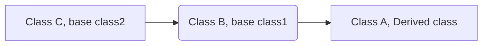

Thoeries review session

# Inheritance

## Base class and derived class

```c++
class derived : public base {
    
   
};
```

1. will inherit public members of base class (so remember to write all virtual functions in base public so derived class can inherit and override them)

2. When creating a child object, parent constructor is called first and then child ctor body is executed. So we will put the parent constructor in the initialization list.


### Polymorphism

```c++
Parent *parent = new Child();
// we can only assign child to parent since child is parent
```

### Virtual

A virtual function is a member function declared within base class (with keyword virtual) and is re-defined (overriden) by derived class. It ensures that correct function is called for an object, regardless of the type of reference (or pointer) used for function call.

```c++
parent->myfunc() // will go to Parent.cpp and 
```


### Pure virtual functions

when we have a function that we don't know how to define in the base class

```c++
virtual void myfunc() = 0;
```


### Abstract class

1. when it has at least one pure virtual function (no other special keyword is needed)
2. cannot create an object of this abstract class
3. derived class must override pure virtual functions (inherited from base class) or they will also become abstract classes. 


### Order of Constructor/Destructor




Order of Ctor call:

```c++
A* a = new A();
delete a;
```

1. C()
2. B()
3. A()

new A() is calling A's ctor (doesn't mater what LHS is), it will call based class ctor first (order is based on hierarchy) before A's body is executed

Order of Dtor call:

1. ~A()
2. ~B()
3. ~C()


How about

```c++
C *c = new A();
delete c;
```

Only ctor ~C() is called. To fix it, we just make ~C() virtual. Then because of polymorphism, we will call ~A(), which will then call ~B() and ~C() in order. In conclusion, making base class dtor virtual guarantees that the object of derived class is dectructed propoerly, i.e., both base class and derived class desctructors are called. 


# List ADT (Abstract Data Type)

### Linked Memory

Linked List

### Array

sequential blocks on memory (copy of whole array is usally required)

```c++
T* arry; //points to the start of List
unsigned count_; // # of current elements
unsigned capacity_; // the maximum size possible
```


# Iterators

encapsulated access to data: provide easier interface for user-end


class using iterators must have two functions

```c++
Iterator begin()

Iterator end()  
```

And for iterator class itself

inherit from std::iterator

operations must define (overload)

```c++
++ // advance to next
* //dereference
!=  //not equal to end()
```


# Trees

## BST

### remove

remove leaf: delete 

remove one-child node (stick or elbow structure): just like a linked list

remove two-children node:	swap node with its iop (in-order-predecessor) 

this IOP is the right-most node on the node's left-subtree so after swapping, it becomes the no-children case. 

